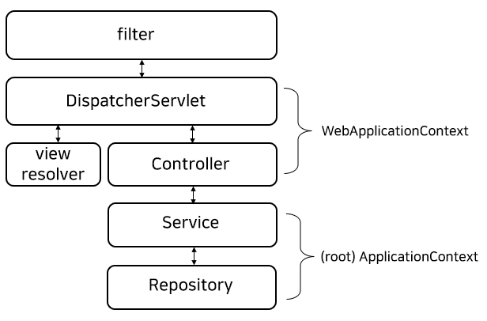

## Servlet
대부분의 시스템들은 웹 기반의 애플리케이션입니다. 자바에서는 "서블릿(Servlet)"이라는 스펙을 통해 웹 애플리케이션 개발 기술을 제공해왔습니다.
현재 서블릿 스펙은 버전 [6](https://jakarta.ee/specifications/servlet/6.0/)까지 나왔으며, 크게 보면 "Jakarta EE Platform"이라는 전체 스펙 하위의 개별 스펙이라고 할 수 있습니다.

>Jakarta Servlet defines a server-side API for handling HTTP requests and responses.

서블릿은 서블릿 "컨테이너(서버)"에서 실행되는 프로그램입니다. 사용자의 HTTP 요청을 받아서 동적인 컨텐츠를 만들어 HTTP 응답으로 리턴하는 프로그램으로 생각하면 될 것 같습니다. 스펙에 따르면 특별한 경우가 아니라면 서블릿 컨테이너는 서블릿 인스턴스를 하나만 생성해야 하기 때문에 서블릿은 "thread-safe" 하지 않습니다. 

>For a servlet not hosted in a distributed environment (the default), the servlet container must use only one instance per servlet declaration

그런데 서블릿만으로 웹 애플리케이션을 구현하는 경우는 사실상 없고 앞으로 다룰 스프링 MVC 패턴을 사용하는 경우가 대부분입니다.

## JSP(Java Server Page) 
서블릿이 자바 웹 기술의 중심이긴 하지만 실용적인 "다이나믹" 웹 애플리케이션을 만들기에는 많은 어려움이 있었습니다. JSP는 HTML과 같이 섞어서 작성되기 때문에 개발 측면에서 훨씬 접근하기 수월합니다. 즉 JSP 소스파일은 HTML과 같은 정적인 부분과 컴파일 지시어, 서버측에서 동적으로 생성되는 부분(스크립트릿)으로 구성되어 작성됩니다. 하지만 JSP도 결국 서블릿으로 컴파일되기 때문에 서블릿이라고 볼 수 있겠습니다. JSP도 개별 [스펙](https://jakarta.ee/specifications/pages/)으로 진행되고 있습니다.

>Jakarta Pages defines a template engine for web applications that supports mixing of textual content (including HTML and XML) with custom tags, expression language, and embedded Java code, that gets compiled into a Jakarta Servlet.

## 서블릿 컨테이너
서블릿은 독립적으로 실행되는 프로그램이 아니기 때문에 실행하려면 "컨테이너"의 역할을 하는 서버("Web Application Server"라고도 합니다)가 필요합니다. 서버의 중요한 역할 중 하나는 애플리케이션을 배치하는 일입니다. 서블릿 스펙에서 이것을 정하고 있는데, 어렵게 생각할 것 없이 이미 익숙한 자바 웹 애플리케이션의 디렉토리 구조입니다.

```
├─META-INF
└─WEB-INF
    ├─classes
    ├─lib
    └─web.xml
```
아무리 복잡한 웹 애플리케이션이라고 해도 위의 기본 구조를 벗어날 수 없습니다. `classes`에는 비지니스 로직을 구현한 클래스들이 들어가고 `lib`에는 디펜던시 라이브러리(*.jar)들이 들어갑니다. `web.xml`에는 웹 애플리케이션을 구성하는 여러 설정 정보들이 들어 갑니다. `WEB-INF` 하위에 있는 파일들은 브라우저에서 직접 접근할 수 없도록 되어 있습니다. 서블릿 스펙을 인용해보겠습니다.

>Also, except for the case where static resources are packaged in JAR files, any requests from the client to access the resources in WEB-INF/ directory must be returned with a SC_NOT_FOUND(404) response

따라서 공개된 정적인 리소스들을 WEB-INF 밖에 위치하는 것이 일반적이고 그 외의 동적인 리소스들(클래스, JSP 등등)은 WEB-INF에 두는 것이 좋습니다.

## Spring MVC
웹 애플리케이션을 개발할 때 가장 많이 사용되는 패턴으로 MVC(Model-View-Controller)가 있는데, 스프링을 많이 사용하게 되면서 스프링 MVC가 사실상 자바 웹의 MVC가 되어 버렸습니다. 

스프링 MVC의 구조는 아래와 같습니다.  



요청이 들어오면 디스패처(서블릿)가 받아서 해당 요청을 전담하는 컨트롤러에게 전달하고 컨트롤러는 다시 서비스(비지니스 로직)를 호출하고 서비스는 레포지토리를 통해 데이터를 처리한 후 그 결과를 컨트롤러에게 리턴 합니다. 디스패처는 컨트롤러에서 넘겨받은 결과(모델)에 적합한 뷰 처리기에게 페이지(뷰)를 생성하도록 합니다.  

이제부터 스프링 MVC의 설정을 알아보겠습니다.

[처음](../README.md) | [다음](../02/README.md)