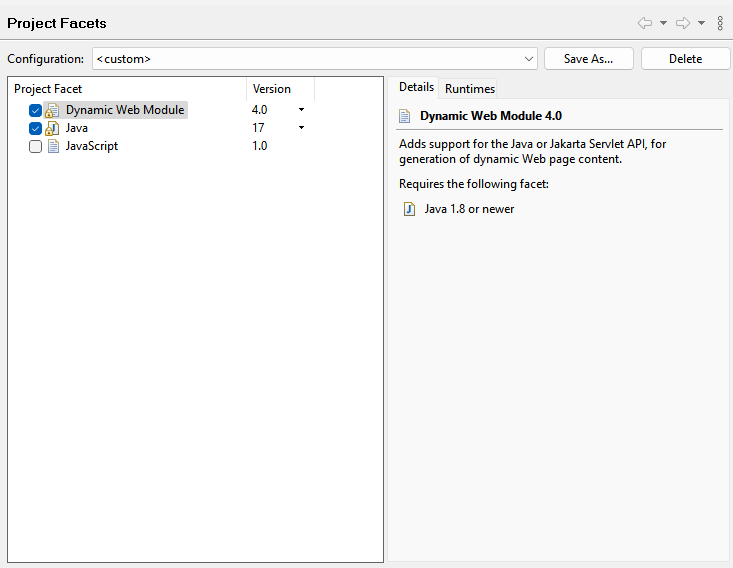

## 스프링 MVC 프로젝트 만들기
STS 4부터는 (스프링 부트가 아닌) Spring MVC 프로젝트를 간단히 만들지 못하기 때문에 수동으로 그레이들 프로젝트를 만들었습니다. STS가 웹 프로젝트로 인식하게 하기 위해서는 Project Facets을 Dynamic Web Module로 지정할 필요가 있습니다. 이때 버전은 서블릿 버전에 맞추어 4.0으로 합니다.

 

이렇게 하면 자동으로 소스 디렉토리 구조가 웹 애플리케이션으로 변경됩니다. 아래 그림처럼 기본 소스폴더 구조에 `webapp`와 `WEB-INF`가 생깁니다.

 

`web.xml`은 톰캣에서 제공하는 파일을 복사해서(XML 문서구조만 남기고 내용은 삭제) `WEB-INF` 아래에 넣으면 되겠습니다.

톰캣은 STS의 런타임 서버로 등록해서 사용합니다. Window > Show View > Server 에서 Apache Tomcat v9.0을 선택하면 되겠습니다. 프로젝트는 원래 톰캣이 설치된 디렉토리에 빌드되서 배포되는 것이 아니라 디폴트 위치로 "워크스페이스 메타데이터"에 생성됩니다. 이 위치는 서버 속성 정보에서, 아래 그림의 Server Locations에 나타나 있습니다.

```
workspace\.metadata\.plugins\org.eclipse.wst.server.core\tmp0
```
STS의 로그가 충분하지 않은 경우 이 위치에 있는 로그를 참조할 수 있습니다.

 

소스파일이 변경되는 경우 자동으로 리로드되지만 설정 파일을 변경하는 경우는 직접 재시작을 해줄 필요가 있습니다. 프로젝트는 다음과 같이 STS 톰캣에 배포할 수 있습니다.


## build.gradle
의존성 라이브러리는 그레이들로 설정합니다. war 파일을 만들기 위해 war 플러그인을 추가합니다. 스프링 MVC를 위해서는 `org.springframework:spring-webmvc`만 추가하면 나머지는 transitive 하게 들어갑니다. 서블릿을 직접 사용해보기 위해 `javax.servlet:javax.servlet-api`도 추가합니다. `Thymeleaf`는 처리 결과를 HTML에 보여주기 위한 "뷰 처리기"로 사용됩니다.

```
plugins {
    id 'java'
    id 'war'
}

repositories {
    mavenCentral()
}

java {
    sourceCompatibility = '17'
}

ext {
    springVersion = '5.3.32'
    springJpaVersion = '2.7.18'
}

war {
   archiveBaseName = 'demo-mvc'
}


dependencies {

    implementation "org.springframework:spring-context:$springVersion"   
    implementation "org.springframework:spring-webmvc:$springVersion" 
    
    compileOnly 'javax.servlet:javax.servlet-api:4.0.0'
    
    // Thymeleaf
    implementation 'org.thymeleaf:thymeleaf:3.1.2.RELEASE'
    implementation 'org.thymeleaf:thymeleaf-spring5:3.1.2.RELEASE'    
    
    // Test
    // Junit5
    testImplementation "org.springframework:spring-test:$springVersion"
    testImplementation 'org.junit.jupiter:junit-jupiter-api:5.9.3'
    testRuntimeOnly 'org.junit.jupiter:junit-jupiter-engine'
    testRuntimeOnly 'org.junit.platform:junit-platform-launcher'
    
    // Data
    implementation "org.springframework:spring-jdbc:$springVersion"
    implementation "org.springframework:spring-orm:$springVersion"
    implementation 'org.apache.commons:commons-dbcp2:2.9.0'    
    runtimeOnly 'com.mysql:mysql-connector-j:8.0.33'
    
    // Hibernate
    implementation 'org.hibernate:hibernate-core:5.3.36.Final'
    
    // Spring JPA
    implementation "org.springframework.data:spring-data-jpa:$springJpaVersion"        
    
    // Logging    
    implementation 'org.slf4j:slf4j-api:2.0.12'
    implementation 'ch.qos.logback:logback-classic:1.5.3'     
}

test {
    useJUnitPlatform()
    testLogging.showStandardStreams=true
    //include '**/*Test.class'
    include 'com/foo/**/*Test.class'    
}

```


[처음](../README.md) | [다음](../03/README.md)